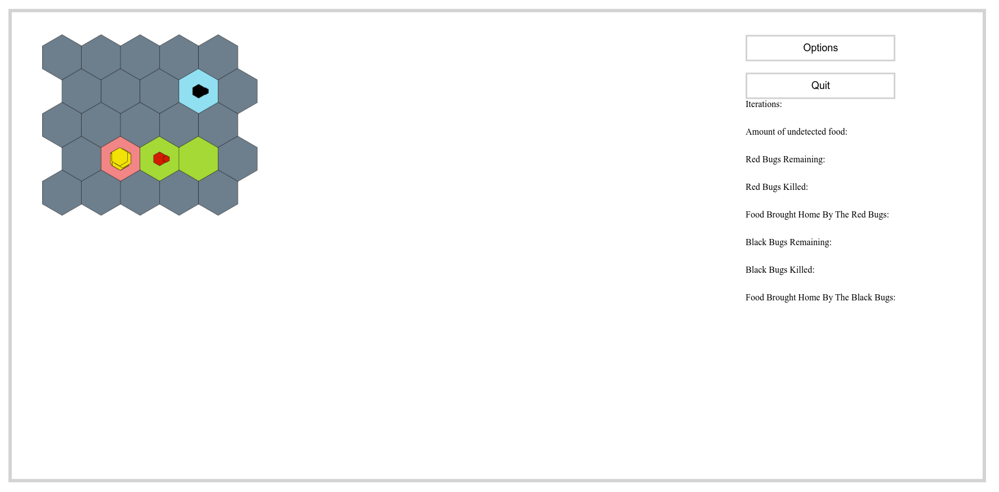

## How to deploy and test

This is application of bug world game using java script and done testing with mocha of js.

It is wil be deployed on Clamv: https://clabsql.clamv.jacobs-university.de/~kgautam/, and tests at https://clabsql.clamv.jacobs-university.de/~kgautam/test/test.html.

For local testing we use `light-server` module (simply to serve static files), because it’s easier then full-fledged server
side solutions.

To install it you can use npm:

```
sudo npm install -g light-server
```

And then run:

```
light-server -s . -b localhost
```

Now the site should be available at http://localhost:4000, and tests are at http://localhost:4000/test/test.html.

Note that sample files for world maps are available in `tests/sampleMaps` and for programs in `tests/samplePrograms`.

## Technologies used

Mostly it is raw JavaScript, with the only exceptions being:

- [Mocha](https://mochajs.org/): unit testing
- [Chai](https://www.chaijs.com/): assertions

## File structure

```
.
├── GUI
│   ├── page.js
│   └── render.js
├── index.html
├── logic
│   ├── BugBrain.js
│   ├── Bug.js
│   ├── CellCondition.js
│   ├── checks.js
│   ├── Color.js
│   ├── Engine.js
│   ├── instructions.js
│   ├── Position.js
│   ├── WorldCell.js
│   └── World.js
├── README.md
├── style.css
└── test
    ├── sampleMaps
    │   ├── 711map.txt
    │   ├── 712map.txt
    │   ├── 713map.txt
    │   ├── 714map.txt
    │   ├── illegalVal.txt
    │   ├── noBorder.txt
    │   ├── notConnected.txt
    │   ├── ok1.txt
    │   ├── ok2.txt
    │   ├── ok3.txt
    │   ├── oneNestOnly.txt
    │   └── tooManyLines.txt
    ├── samplePrograms
    │   ├── collect.txt
    │   └── simple.txt
    ├── test.html
    └── test.js
```

## Preview



- These are based on our previous sprints
  - Set up a linter to ensure a stable codestyle
  - Set up testing with Mocha and Chai
  - GUI
    - Hexagonal grid for the map
    - Rendering free / blocked cells and the amount of food there
    - Rendering base cells
    - Rendering bugs with their directions and food
  - `WordCell` class with tests
  - `World` class with tests
  - `Bug` class with tests
  - `Color` and `CellCondition` enumerations, also covered in tests
  - `Position` class, covered in tests
  - `BugBrain` class, partially implemented
  - More thorough world checks, including connectivity
  - Sample maps with many corner cases
- Removed inline JS listeners and rewrote code from scripts to modules
- Refactored completely unreadable `assemble` into multiple functions with smaller responsibilities
- Connected file loaders from this code base to the GUI from the old one
- Classes for instructions, covered in tests
- Serialization and deserialization for them with tests
- `Engine` class with tests
- Connected it to GUI, now simulation is working
- Processing instructions, tests for the most important ones
- Implemented program parsing, covered with tests
